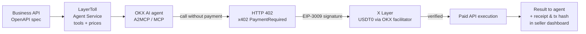

<p align="center"></p>

<h1 align="center">LayerToll</h1>

<p align="center">
  <a href="https://github.com/karaca8640/layertoll/actions/workflows/ci.yml"></a>
  <a href="LICENSE"></a>
  
  
  
</p>

## Product

**Turn any business API into a paid AI-agent service in a few clicks — OKX AI agents discover it, call it, and pay per request with x402 on X Layer.**

Built for **OKX Dev Day 2026** on top of the open-source [XPack MCP Marketplace](https://github.com/xpack-ai/XPack-MCP-Marketplace) (Apache-2.0). See [What we built](#what-we-built-during-okx-dev-day-2026) and [UPSTREAM.md](UPSTREAM.md).

| | |
|---|---|
| **Problem** | Businesses already have useful HTTP APIs, but AI agents can't find them, don't know their input schemas, and can't pay for a single call without accounts, API keys and prepaid billing. |
| **What it does** | Import an OpenAPI spec → tools with JSON schemas are generated → pick free/paid tools and a USD price per call → publish OKX AI **A2MCP** endpoints and an **MCP** endpoint → paid calls return **HTTP 402 (x402)**, are paid in **USDT0 on X Layer**, verified, then the real API runs → seller sees calls, receipts and X Layer tx hashes. |
| **OKX AI** | Every tool gets an A2MCP HTTPS endpoint that follows the OnchainOS `a2mcp-probe` contract, plus a ready-to-submit OKX AI listing draft (4-line A2MCP service description, fee, endpoint). |
| **X Layer** | Payments settle on X Layer (`eip155:196`, USDT0 `0x779D…3736`; testnet `eip155:1952`). Each settlement tx is re-checked on the X Layer RPC. |
| **Why x402** | It is the pay-per-call standard A2MCP requires: no account, no API key, no subscription — the agent pays exactly for the call it makes, and the API only runs after payment is verified. |
| **Live demo** | Not deployed yet — see [Deployment](#deployment). Run it locally in one command. |
| **Demo video** | Demo video: TO BE ADDED |
| **60-second check** | [Judge verification](#judge-verification--60-second-path) |

## Status (honest)

| Component | Status |
|---|---|
| A2MCP endpoint (402 challenge, `PAYMENT-SIGNATURE` retry, `input_required`) | **Implemented**, covered by end-to-end tests |
| MCP endpoint with x402 MCP transport (`_meta["x402/payment"]`) | **Implemented**, tested with the official MCP client |
| x402 verify / settle via official OKX SDK + OKX facilitator | **Implemented**; the live OKX facilitator path needs OKX API credentials, which are **not configured** in this repo. Without them paid calls fail closed. |
| X Layer settlement | **No mainnet transaction has been made by this project yet.** No tx hashes are shown anywhere until one exists. |
| OKX AI marketplace listing | **Pending** — listing drafts are generated; submission needs a public HTTPS deployment and the seller's OnchainOS Agentic Wallet, then OKX review. |
| Public deployment | **Not deployed** (requires a host; see Deployment) |

## How it works



Business API → Agent Service → OKX AI → x402 → X Layer → Paid API Execution

1. **Add API** — OpenAPI URL, file upload, or the bundled demo API. Each operation becomes an MCP tool with a valid name (`[A-Za-z0-9_-]{1,64}`) and an input schema.
2. **Configure & price** — enable/disable tools, set a USD price per call (≤ 6 decimals, USDT0 has 6), set the X Layer payout wallet.
3. **Publish** — exposes `/a2mcp/{service}/{tool}`, `/a2mcp/{service}` (manifest) and `/agent-mcp/{service}` (MCP).
4. **Agent call** — free tool: runs immediately. Paid tool without payment: `402` + `PAYMENT-REQUIRED`. The upstream API is **not** called.
5. **Pay** — the agent signs an EIP-3009 `transferWithAuthorization` for USDT0 and retries with `PAYMENT-SIGNATURE`.
6. **Verify → execute → settle** — requirement match (network, asset, amount, payTo), replay check on the EIP-3009 nonce, facilitator verify, **then** the business API runs, then settlement. If the API fails, the payment is not settled and the agent is not charged.
7. **Receipt** — `PAYMENT-RESPONSE` to the agent; call, payer, amount and X Layer tx hash (with RPC confirmation) in the Settlement dashboard.

## OKX integration

### OKX AI / A2MCP
- Contract taken from OKX's own OnchainOS CLI source (`okx/onchainos-skills`, `cli/src/commands/agent_commerce/a2mcp_probe`): HTTPS endpoint, GET or POST, `{"status":"input_required","fields":[…]}` for missing params, `402` + `PAYMENT-REQUIRED` for payment, 2xx result.
- Listing drafts follow the OnchainOS A2MCP service contract (`serviceName` 5–30 chars, exactly four `[Service Description] / [Parameter Spec] / [Request Method] / [Request Example]` lines with a runnable curl, `fee` ≤ 6 decimals). Registration uses the seller's own Agentic Wallet: `npx -y @okxweb3/onchainos-installer install`, then the OnchainOS ASP register/list flow.
- Code: [`services/agentpay/a2mcp_http.py`](services/agentpay/a2mcp_http.py), [`listing.py`](services/agentpay/listing.py).

### X Layer
- One config module: [`services/agentpay/xlayer.py`](services/agentpay/xlayer.py). Values cross-checked against the OKX Payments SDK and live RPC `eth_chainId`:

| | Mainnet | Testnet |
|---|---|---|
| Chain ID / CAIP-2 | 196 / `eip155:196` | 1952 / `eip155:1952` |
| RPC | `https://rpc.xlayer.tech` | `https://xlayertestrpc.okx.com` |
| Explorer | `https://www.oklink.com/xlayer` | `https://www.oklink.com/xlayer-test` |
| Payment asset | USD₮0 `0x779Ded0c9e1022225f8E0630b35a9b54bE713736` (6 dp, EIP-3009) | USD₮0 `0x9e29b3aada05bf2d2c827af80bd28dc0b9b4fb0c` |
| Gas | OKB | OKB |

- After settlement the tx receipt is fetched from the X Layer RPC and checked for a USDT0 `Transfer` to the payout wallet ≥ price ([`onchain.py`](services/agentpay/onchain.py)).
- No private keys anywhere in the server: the seller only configures a public payout address; the buyer signs on their side.

### x402 / payments
- Official **OKX Payments Python SDK** [`okxweb3-app-x402`](https://github.com/okx/payments/tree/main/python/x402): `x402ResourceServer` + `ExactEvmScheme` (EIP-3009), `OKXFacilitatorClient` (`/api/v6/pay/x402/{verify,settle,supported}`, HMAC-signed with your OKX API key). No custom payment protocol.
- x402 v2 HTTP transport headers (`PAYMENT-REQUIRED`, `PAYMENT-SIGNATURE`, `PAYMENT-RESPONSE`) and the x402 MCP transport (`_meta["x402/payment"]`, `_meta["x402/payment-response"]`).
- Fail closed: no facilitator credentials → every proof is rejected (`503 facilitator_not_configured`), the API never runs.
- Replay protection: `(network, payer, EIP-3009 nonce)` is a DB primary key; forged proofs are released so they cannot burn a real payer's nonce.
- Stripe/Alipay/WeChat from upstream remain as optional **legacy billing** for the upstream `/mcp` endpoints; they are not part of the agent payment path.

## What we built during OKX Dev Day 2026

**Upstream foundation (XPack, not ours):** OpenAPI ingestion, MCP marketplace and `/mcp` endpoints, admin/user/account infrastructure, prepaid wallet + Stripe billing, Next.js marketplace UI.

**Built during OKX Dev Day 2026:**
- OKX AI A2MCP compatibility (endpoint contract + listing drafts)
- X Layer network integration + on-chain settlement check
- x402 payment gate on the official OKX SDK: verify-before-execute, settle-after-execute, replay protection, fail-closed
- Paid agent-service execution for two transports (A2MCP HTTPS, MCP with x402 MCP transport)
- API → agent-service onboarding flow (import, tool toggles, per-tool pricing, payout wallet, publish, real test call)
- Receipts + seller revenue dashboard, public Judge mode
- Web Intelligence demo business API (real computation, no API key)
- Importer fixes: valid MCP tool names, base URL from `servers`, prices kept on re-import
- 37 automated tests (upstream had none), CI, Docker Compose deployment, secret-free config
- Hackathon UX and LayerToll branding with upstream credit

Details and commit mapping: [BUILD_LOG.md](BUILD_LOG.md). File-level provenance: [UPSTREAM.md](UPSTREAM.md).

## Judge verification — 60-second path

```bash
python scripts/generate_env.py && docker compose up -d --build
```
1. Open `http://localhost:8000/admin` (admin / `123456789` — upstream default, change it) → **Agent Services → Add API → Demo API → Generate tools**.
2. Set a payout wallet, keep the suggested prices, **Publish**.
3. Open `http://localhost:8000/judge` → **Call free tool** (real result) → **Call paid tool without payment** (HTTP 402 with decoded x402 requirements).
4. Terminal: `python scripts/demo_agent.py --base http://localhost:8000` — manifest discovery, free call, 402 challenge.
5. `pip install -r requirements-dev.txt && python -m pytest -q` — the paid flow end to end (valid / invalid / replayed / underpaid payments, upstream failure, MCP client).

## Architecture

```
nginx :80
 ├─ /                       Next.js frontend (console, /judge)
 ├─ /api/*                  admin service :8001  (upstream admin + /api/agentpay)
 ├─ /a2mcp/{svc}[/{tool}]   agent gateway :8002 ─┐
 ├─ /agent-mcp/{svc}        agent gateway :8002 ─┤
 └─ /mcp/*                  upstream MCP (API key + prepaid wallet)
                                                 │
            AgentToolExecutor ◄──────────────────┘
              ├─ PaymentGate (OKX x402 SDK) ── OKX facilitator ── X Layer (USDT0)
              │                              └─ X Layer RPC receipt check
              └─ business API via httpx (seller headers never exposed)
                 e.g. demo API at 127.0.0.1:8002/demo-api — internal only, not routed by nginx

MySQL: services, tools, prices, agent_call receipts, replay keys · Redis + RabbitMQ: upstream billing
```

Key modules: [`services/agentpay/`](services/agentpay) · admin API [`controllers/agentpay.py`](services/admin_service/controllers/agentpay.py) · UI [`frontend/src/components/agent-services/`](frontend/src/components/agent-services) · migration [`version-1.4.0.sql`](scripts/resource/sql/version-1.4.0.sql).

## Running locally

**Docker (recommended):** `python scripts/generate_env.py && docker compose up -d --build`, then `http://localhost:8000`.

**Without Docker** (needs MySQL 8, Redis, RabbitMQ; Python ≥ 3.11, Node 22, pnpm 10):
```bash
python -m venv .venv && . .venv/bin/activate && pip install -r requirements-dev.txt
cp .env.example .env   # fill in values
python scripts/resource/init_db.py   # applies init.sql + version-*.sql
uvicorn services.admin_service.main:app --port 8001 &
uvicorn services.api_service.main:app --port 8002 &
cd frontend && pnpm install && NEXT_PUBLIC_API_URL=http://127.0.0.1:8001 pnpm dev
```

## Environment variables

Names only (see [.env.example](.env.example)); never commit values.
`MYSQL_HOST MYSQL_PORT MYSQL_USER MYSQL_PASSWORD MYSQL_DB` · `REDIS_HOST REDIS_PORT REDIS_PASSWORD REDIS_DB` · `RABBITMQ_HOST RABBITMQ_PORT RABBITMQ_USER RABBITMQ_PASSWORD RABBITMQ_VHOST BILLING_QUEUE_NAME` · `API_PORT ADMIN_PORT DEBUG LOG_LEVEL ALLOWED_ORIGINS LAYERTOLL_PORT` · `PAYMENT_CONFIG_SECRET_KEY PAYMENT_CONFIG_KEY_ID` · `AGENTPAY_NETWORK XLAYER_RPC_URL AGENTPAY_PUBLIC_BASE_URL AGENTPAY_DEFAULT_PAYOUT_WALLET AGENTPAY_PAYMENT_TIMEOUT_SECONDS AGENTPAY_UPSTREAM_TIMEOUT_SECONDS AGENTPAY_VERIFY_ONCHAIN AGENTPAY_API_INTERNAL_URL DEMO_API_BASE_URL` · `OKX_API_KEY OKX_SECRET_KEY OKX_PASSPHRASE OKX_FACILITATOR_BASE_URL`

## Testing

```bash
pip install -r requirements-dev.txt
python -m pytest -q                         # backend: 37 tests
cd frontend && pnpm check-types && pnpm lint:agentpay && pnpm build
```
The tests use SQLite and in-memory Redis/RabbitMQ stand-ins, the official x402 SDK client to sign real EIP-3009 payments with a throw-away key, and a local facilitator **test double** that verifies signatures with the SDK's EIP-712 code. They cover: free tool, paid tool without payment (402, API not called), valid payment (executes + settles + receipt), replayed / tampered / forged / underpaid / redirected / garbage / expired proofs, no facilitator (fail closed), upstream failure (safe error, not charged), `input_required`, OpenAPI import schemas and tool names, X Layer config vs. the official SDK, on-chain receipt check, MCP client x402 flow, secret non-disclosure, pricing/publish rules, dashboard and judge data.

`pnpm lint` (whole frontend) reports pre-existing findings in upstream files; the CI lint gate covers LayerToll's frontend code.

## Deployment

The app is one container plus MySQL, Redis and RabbitMQ (`docker-compose.yml`). Any VM with Docker works (e.g. a small cloud VM): set `AGENTPAY_PUBLIC_BASE_URL` to your HTTPS origin, put TLS in front (Caddy/nginx/cloud LB), then `docker compose up -d --build`. OKX AI A2MCP listings require that public HTTPS URL. No public deployment exists yet for this repository.

## Build period / provenance

Upstream repository: `https://github.com/xpack-ai/XPack-MCP-Marketplace`

This project is based on the Apache-2.0 licensed XPack MCP Marketplace. The OKX AI, A2MCP, X Layer, x402 payment flow, agent-service onboarding, settlement experience and hackathon-specific product work were added for OKX Dev Day 2026.

The first commit is the unmodified upstream import; every later commit is our work ([BUILD_LOG.md](BUILD_LOG.md)).

## License

Apache License 2.0 — see [LICENSE](LICENSE) and [NOTICE](NOTICE). Upstream copyright remains with the XPack authors; modified upstream files are marked. OKX, OKX AI, OnchainOS and X Layer are trademarks of their owners; LayerToll is an independent hackathon project, not affiliated with or endorsed by OKX or XPack.
